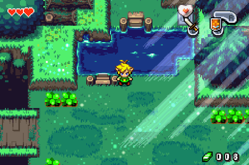
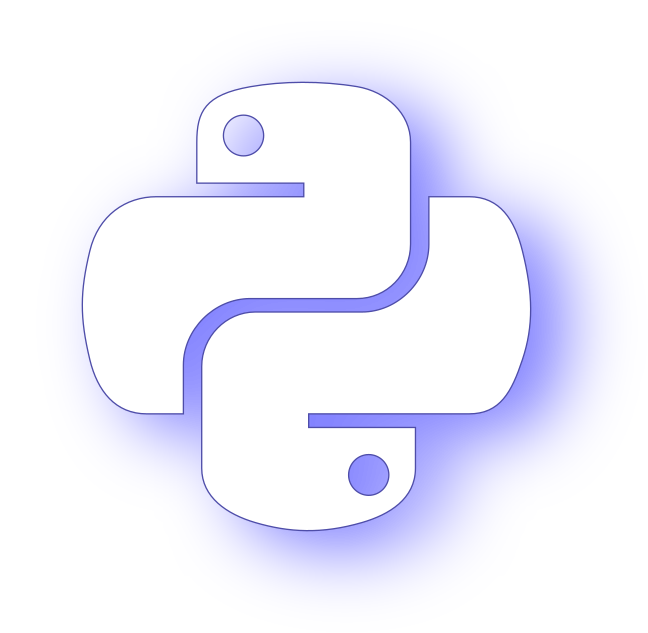
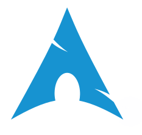

# Hello World!

<div imgs align="right">

𝓖𝓪𝓶𝓮 𝓓𝓮𝓿 𝓲𝓼 𝓶𝔂 𝓹𝓪𝓼𝓼𝓲𝓸𝓷
[](https://gersonfedutra.itch.io/)
[](https://linkedin.com/in/gersonfedutra)
[](https://instagram.com/gersonfedutra/)

</div>

<!-- [](https://twitter.com/GersonFeDutra) -->

<div topics>



- ⭐ Favorites:
    - Languages: **[C/C++](https://en.cppreference.com/w/cpp)**, [ **Python**](https://www.python.org/) & **[Go](https://go.dev/)**
    - Topics: Software Engineering & Game Development
- Currently learning:
    - Calculus & Linear Algebra
    - Automatae & Formal Languages
    - Unreal, **C++** & Game Development
    <!-- - Algorithms Design -->
    <!-- - Blender & Unreal Engine -->
    <!-- - Typescript & Flutter -->
    <!-- - Calculus & Statistics -->
    <!-- - Calculus & Physics -->
    <!-- - Computer Graphics: Open GL -->
- Interests:
    - Computer Graphics & Shaders
    - Game/ Graphics/ Software Design
    - Procedural Generation & AI
- I 💙 [ **Godot**](https://godotengine.org/)
    - Enthusiast since 2016~

</div>


### Tools
---

<div id="tools">

[](https://git-scm.com/) &emsp;
[](https://docs.github.com/) &emsp;
[](https://www.linux.org/) &emsp;
[](https://archlinux.org/) &emsp;
[](https://www.gnu.org/software/bash/) &emsp;
[](https://www.vim.org/) &emsp;
[](https://neovim.io/) &emsp;
[](https://code.visualstudio.com/) &emsp;
[](https://www.amazon.com/dp/0131103628) &emsp;
[](https://en.cppreference.com/w/cpp) &emsp;
[](https://www.python.org/) &emsp;
[](https://www.microsoft.com/pt-br/microsoft-365/excel) 
<!---->

</div>

---


```Cpp
#include <iostream>
int main(void)
{
#if defined(__unix__) || defined(__linux__)
    std::cout << "\033[32m" "Hello World!" "\033[m\n";
#else
    std::cout << "Hello World!" << std::endl;
#endif
}
```
