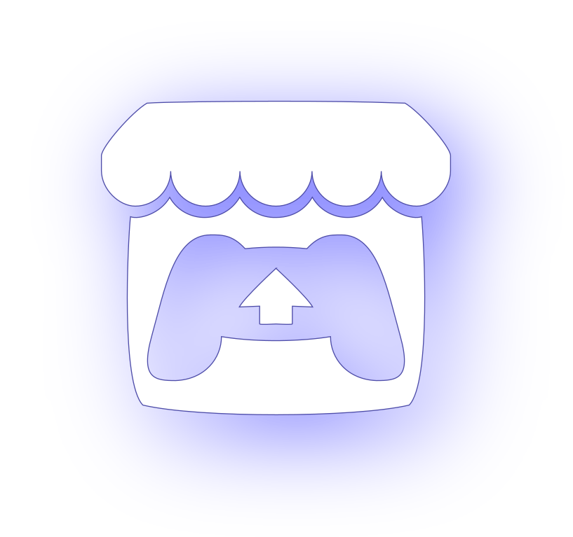

# Hello World!

_𝒢𝒶𝓂𝑒𝒟𝑒𝓋 𝒾𝓈 𝓂𝓎 𝓅𝒶𝓈𝓈𝒾𝑜𝓃_

- Favorite languages: [ **Python**](https://www.python.org/) & **C**
- Currently learning:
    - Algorithms & Data Structures
    - Software Engineering
    - Calculus & Statistics
- Interests: _**C++**_, Game Development
- I 💙 [ **Godot**](https://godotengine.org/)

<!-- --- -->

### Tools
---

 <!-- &emsp; --> <!--  --> <!-- &emsp; --> <!--  --> <!-- &emsp; --> <!--  --> &emsp;  &emsp;  &emsp;  &emsp;   &emsp; <!--  --> <!-- &emsp; -->  &emsp; 
<!--  -->

---

<!--   -->

